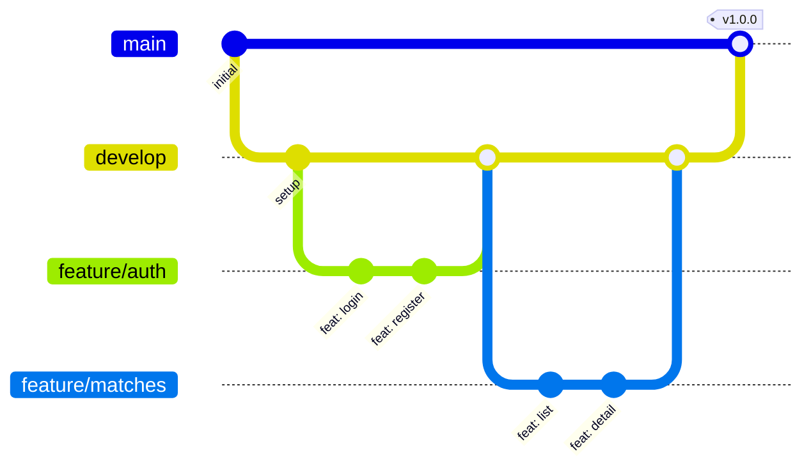

# Branch Protection Rules

Ce document décrit les règles de protection des branches à configurer sur GitHub.

## 🌿 Structure des branches

```
main (production)
├── develop (staging/preview)
│   ├── feature/nom-fonctionnalite
│   ├── fix/nom-correction
│   ├── docs/nom-documentation
│   └── refactor/nom-refactoring
```

## 🔒 Règles pour `main`

À configurer dans **Settings > Branches > Add rule** :

### Branch name pattern: `main`

- [x] **Require a pull request before merging**

  - [x] Require approvals: `1`
  - [x] Dismiss stale pull request approvals when new commits are pushed
  - [x] Require review from Code Owners

- [x] **Require status checks to pass before merging**

  - [x] Require branches to be up to date before merging
  - Status checks requis:
    - `🔍 Lint`
    - `📝 Type Check`
    - `🏗️ Build`

- [x] **Require conversation resolution before merging**

- [x] **Do not allow bypassing the above settings**

- [ ] Allow force pushes: **Désactivé**
- [ ] Allow deletions: **Désactivé**

## 🔒 Règles pour `develop`

### Branch name pattern: `develop`

- [x] **Require a pull request before merging**

  - [x] Require approvals: `1`

- [x] **Require status checks to pass before merging**

  - Status checks requis:
    - `🔍 Lint`
    - `📝 Type Check`

- [ ] Allow force pushes: **Désactivé**
- [ ] Allow deletions: **Désactivé**

## 📋 Workflow de développement

1. **Créer une branche feature** depuis `develop`:

   ```bash
   git checkout develop
   git pull origin develop
   git checkout -b feature/ma-fonctionnalite
   ```

2. **Développer et commiter** (Conventional Commits):

   ```bash
   git add .
   git commit -m "feat: ajouter le composant CardMatch"
   ```

3. **Pousser et créer une PR** vers `develop`:

   ```bash
   git push origin feature/ma-fonctionnalite
   ```

   → Créer PR vers `develop` sur GitHub

4. **Après review et merge dans `develop`**:

   - Le déploiement preview s'effectue automatiquement

5. **Release vers production**:
   - Créer une PR de `develop` vers `main`
   - Après merge, le déploiement production s'effectue automatiquement

## 🏷️ Conventions de nommage

| Préfixe     | Usage                                 |
| ----------- | ------------------------------------- |
| `feature/`  | Nouvelle fonctionnalité               |
| `fix/`      | Correction de bug                     |
| `docs/`     | Documentation                         |
| `refactor/` | Refactoring de code                   |
| `style/`    | Changements de style (CSS, formatage) |
| `test/`     | Ajout ou modification de tests        |
| `chore/`    | Tâches de maintenance                 |

## 🔄 Exemple de flux complet


